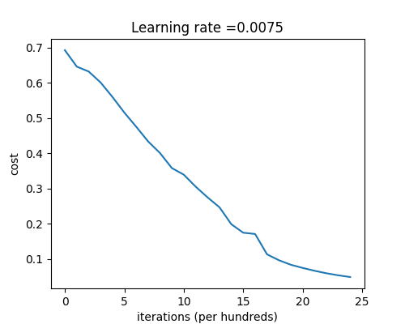
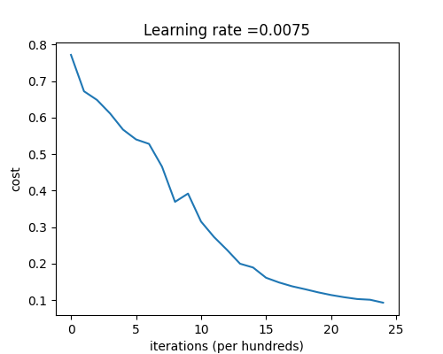
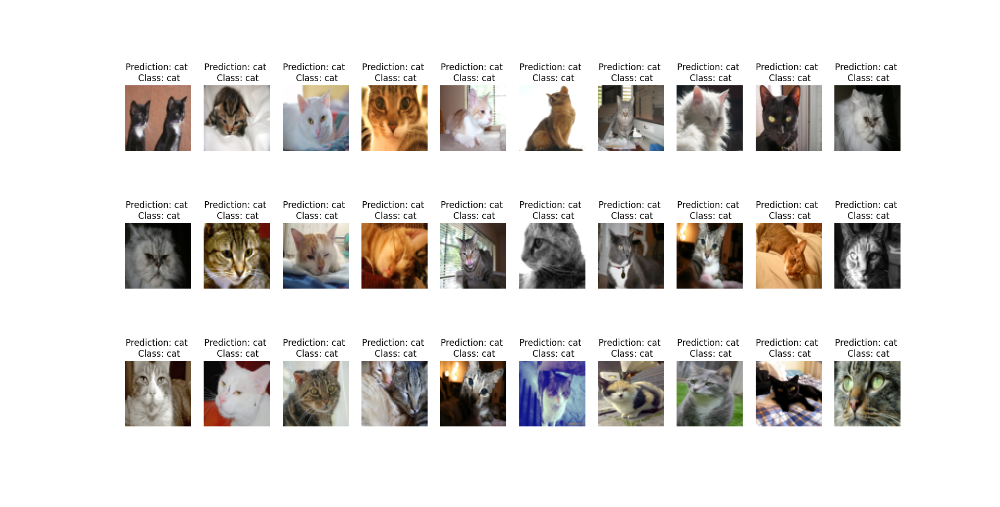
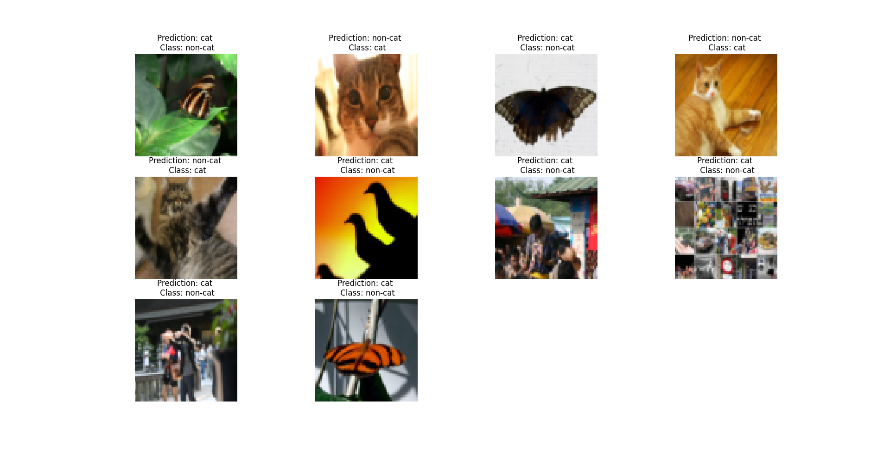

# Deep Neural Network from Scratch - Cat vs Non-Cat Classification

This project is a **personal implementation** of a deep neural network, built entirely from scratch using **NumPy**.  
The goal is to classify images as **cat (1)** or **non-cat (0)** using a dataset provided in HDF5 format.
The code is based on exercises from the **DeepLearning.AI Deep Learning Specialization (Coursera)** but includes custom modifications and new helper functions.
The original course materials, datasets, and exercises are property of **DeepLearning.AI / Andrew Ng** and are used here for educational and personal practice purposes only.

---

## Features

- Implementation of forward and backward propagation
- Support for **Sigmoid** and **ReLU** activation functions
- Custom **parameter initialization** (including Xavier initialization for deep networks)
- Gradient descent optimization
- Model evaluation with accuracy reporting
- Visualization of:
  - Correctly classified images
  - Mislabeled images

---

## Project Structure
```text
deep-meow-network/
├── dataset/
│   ├── train_catvnoncat.h5
│   └── test_catvnoncat.h5
├── images/
│   ├── Cat_OK.png
│   ├── Cat_NOK.png
│   ├── cost_iterations_2Layer_NN.png
│   └── cost_iterations_4Layer_NN.png
├── dnn_utils.py
├── planar_utils.py
├── main.py
└── README.md
```

---

### Explanation:
- `dataset/`: contains the training and test datasets in HDF5 format  
  These are automatically loaded using the `load_data()` function from `dnn_utils.py`.  
- `dnn_utils.py`: core neural network implementation (sigmoid, relu,sigmoid_backward,relu_backward, forward/backward propagation calculation, cost function, training, prediction, visualization)   
- `main.py`: script to run the model 
  - Loads and preprocesses the dataset
  - Implements two types of neural networks:
    1. **Two-layer network**  
       Architecture: `INPUT -> LINEAR -> RELU -> LINEAR -> SIGMOID -> OUTPUT`  
       Trained on the preprocessed images for binary classification (cat / non-cat).

    2. **Four-layer deep network**  
       Architecture: `INPUT -> [LINEAR -> RELU] x 3 -> LINEAR -> SIGMOID -> OUTPUT`  
       Trained on the preprocessed images for binary classification (cat / non-cat).
       A deeper and more scalable model, achieving higher performance.
    
  - Both models include:
    - Parameter initialization (`initialize_parameters`, `initialize_parameters_deep`).
    - Forward propagation (`linear_activation_forward`, `L_model_forward`).
    - Backward propagation (`linear_activation_backward`, `L_model_backward`).
    - Cost computation (`compute_cost`).
    - Parameter updates using *Gradient Descent* (`update_parameters`).

- `README.md`: project documentation 

---

## Dataset

The dataset comes from the **cat vs non-cat** classification challenge:  
- **Training set**: 209 images  
- **Test set**: 50 images  
- **Image size**: 64x64 pixels, RGB  

The data is stored in `.h5` files:
- `train_catvnoncat.h5`
- `test_catvnoncat.h5`

Classes are defined as:
- `0`: non-cat
- `1`: cat

---

## Results
- Implements two types of neural networks with num_iterations=2500 and learning_rate=0.0075
    1. **Two-layer network**  
       Architecture: `INPUT -> LINEAR -> RELU -> LINEAR -> SIGMOID -> OUTPUT`  
       Trained on the preprocessed images for binary classification (cat / non-cat).

    
    
    **Training Accuracy:** 99.99%
    **Test Accuracy:** 72%

    2. **Four-layer deep network**  
       Architecture: `INPUT -> [LINEAR -> RELU] x 3 -> LINEAR -> SIGMOID -> OUTPUT`  
       A deeper and more scalable model, achieving higher performance.

    
    
    **Training Accuracy:** 98.56%
    **Test Accuracy:** 80%

-   With the Four-layer deep neural network, it has been possible to see:
    
    
    During testing, some cat images were not classified correctly. This usually happened in situations such as:
    - Cats in **unusual poses** (e.g., curled up or partially hidden).
    - Cats placed against a **background with similar colors**, making it harder to distinguish the shape.
    - **Less common breeds or colors**, which differ from those seen during training.
    - **Challenging camera perspectives** or angles.
    - **Lighting issues** such as very dark or overly bright images.
    - **Scale variations**, where the cat appears very small or very large within the frame.

---

## Next steps
- Trying some regularization techniques
- Testing with a bigger number of iterations 
- Testing with a larger dataset
- Experimenting with different activation functions or optimizers
- Refactoring the code into classes for better scalability and maintainability
- Enhancing visualization with more advanced matplotlib/seaborn plots

---

## Author


**Jordi Moreso Milan**
